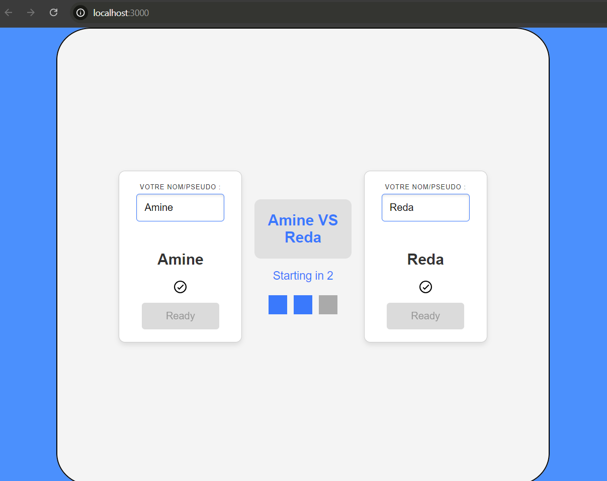

# Tic-Tac-Toe Game 

A simple Tic-Tac-Toe game built with React, allowing players to take turns, track game history, and revisit past moves. The project is Dockerized, making it easy to set up and run in a consistent environment. The game also features a responsive design, ensuring a seamless experience across different devices.

## 🛠 Features
- **Interactive Game Board**: A 3x3 grid where players take turns clicking to place their 'X' or 'O'.
- **Player Input**: Customizable player names with input validation to ensure correct naming conventions.
- **Game Status**: Displays the current player's turn and announces the winner when the game ends.
- **Game History**: Tracks every move, allowing players to view and "jump" to previous steps of the game.
- **Countdown Before Start**: A countdown animation to build anticipation before the game starts.
- **Winner Determination**: Built-in logic to determine the winner of the game.
- **Responsive Design**: Adapts seamlessly to different screen sizes and devices.
- **Dockerized Setup**: Easily run the app in a containerized environment using Docker.

## 🎮 Functionalities
### 1. **Gameplay**
   - A 3x3 grid that alternates between 'X' and 'O' as players click on the squares.
   - Displays the current player’s turn and announces the winner once the game is complete.
   - Prevents further moves after a game concludes, ensuring clear gameplay.

### 2. **Player Input Screen**
   - Allows players to enter their names before starting the game.
   - Validates input and displays error messages for invalid names, ensuring a smooth setup experience.

### 3. **Game History**
   - Tracks each move in a history array, allowing users to view the sequence of moves.
   - Players can "jump" to any previous move, letting them see the board's state at that point.
   - Includes a reset button to restart the game and clear the history.

### 4. **Countdown Before Game Start**
   - Once both players are ready, a countdown animation indicates the beginning of the game, providing an engaging transition to the main gameplay screen.

### 5. **Winner Determination**
   - Includes logic to identify a winner based on predefined winning line combinations (rows, columns, diagonals).
   - Displays the winner when one is found, or announces the next player's turn.

## 📸 Screenshots

### 1. **Welcome Screen**
   
   - A welcoming interface that introduces the Tic-Tac-Toe game.
   - Features a start button to initiate the game.

### 2. **Player Input Screen**
   
   - Players can enter their names to personalize the game.
   - The interface displays player names and readiness status, with validation for input correctness.

### 3. **Invalid Input Handling**
   
   - Handles invalid input with clear error messages to guide players.
   - Highlights input errors in real-time, providing a user-friendly experience.

### 4. **Countdown Before Game Start**
   
   - When both players are ready, a countdown animation indicates the start of the game.
   - The transition to the game board is smooth and interactive.

### 5. **Game Board**
   
   - A 3x3 grid representing the game board.
   - Interactive squares that highlight on hover and respond to clicks with 'X' or 'O'.
   - Displays the current player's turn and game status.

### 6. **Game History and Navigation**
   
   - Tracks the sequence of moves and allows players to navigate to previous states of the game.
   - Includes a reset button to start a new game.

## 🖥️ Responsive Design
   - The application is fully responsive, adapting to different screen sizes to ensure an optimal user experience on desktops, tablets, and mobile devices.
   - Uses flexible grid layouts to maintain the structure of the game board, player inputs, and status displays across varying screen dimensions.

## 🚀 Getting Started

### Prerequisites
- [Docker](https://www.docker.com/get-started) installed on your machine.

### Running the App with Docker

1. **Clone the Repository**
   - Start by cloning the repository to your local machine using the command below:
   ```bash
   git clone https://github.com/amineenim/TicTacToe-Game.git
   cd TicTacToe-Game/
This will download the project files into a folder named TicTacToe-Game and navigate into it.

2. **Build the Docker Image**
   - Build the Docker image using the command below:
   ```bash
   docker build -t react-tictactoe-app .
3. **Run the Docker Container and Mount a Volume**
   - Use the following command to run the container, map port 3000, and mount the current directory:
   ```bash
   docker run -v ${PWD}:/usr/src/app -p 3000:3000 react-tictactoe-app
4. **Access the Application**
   - Open your web browser and go to [http://localhost:3000](http://localhost:3000) to see the Tic-Tac-Toe game interface.

